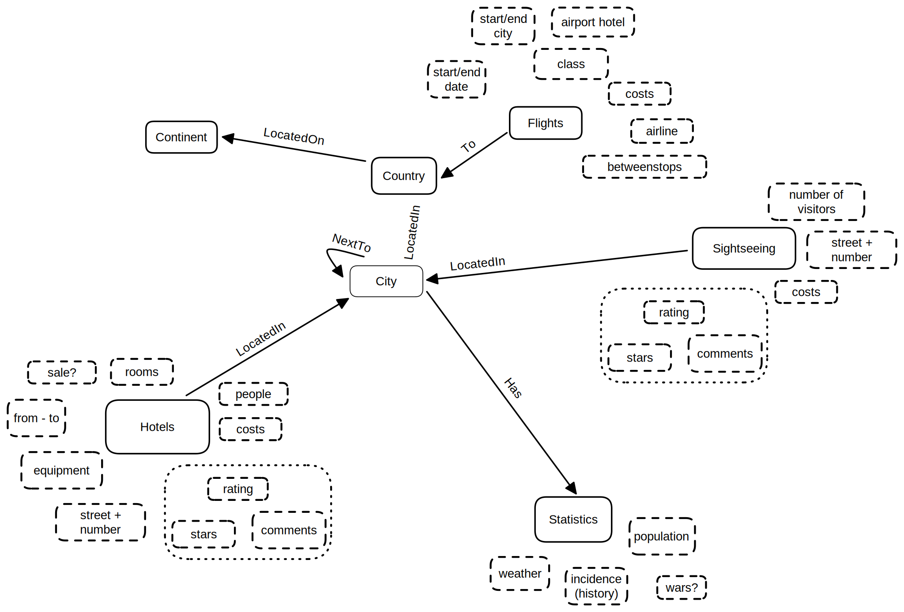
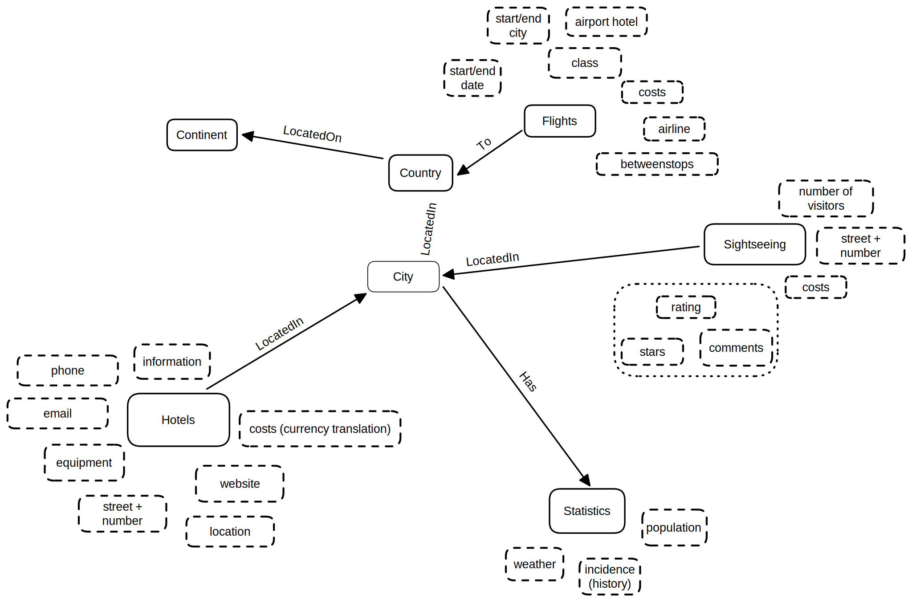

# Our TravelAPI

<br>

## Table of contents of the different pages

1. [The idea](md/idea.md)
2. [The CovidAPI](md/covidAPI.md)


<br>

## A simple way to get information bout a destination
... by getting Covid statistics <br>
... by getting flights <br>
... by getting hotels <br>
... by getting sightsseeing data <br>
... by getting statics for cities (e.g. weather) <br>
[... read more](md/idea.md)

### API's we use
   * [CovidAPi](https://rapidapi.com/api-sports/api/covid-193/) - To Display Covid Statistics for a sertain day


### Domain
   Peter möchte mit seiner Frau Lois und seinen Kindern in den Urlaub fahren. Da ihm die Gesundheit seiner Familie sehr am Herzen liegt, möchte er sich ausreichend über die Inzidenz vorort informieren. Außerdem hat er noch keine Unterkunft gefunden. Nun möchte er, um keine unterschiedlichen Informationen zu erhalten, sowohl die Inzidenzwerte, als auch Informationen über mögliche Unterkünfte an einem Ort suchen.

### Domain models
- First model <br>
   
- Second model <br>
   

<br>

### Database

Run each commands in terminal, close terminal. run app.js

```console
   docker run \
      --name travel \
      -e POSTGRES_PASSWORD=traveldb \
      -p 5432:5432 \
      -d postgres

   docker exec -ti -u postgres travel psql
```