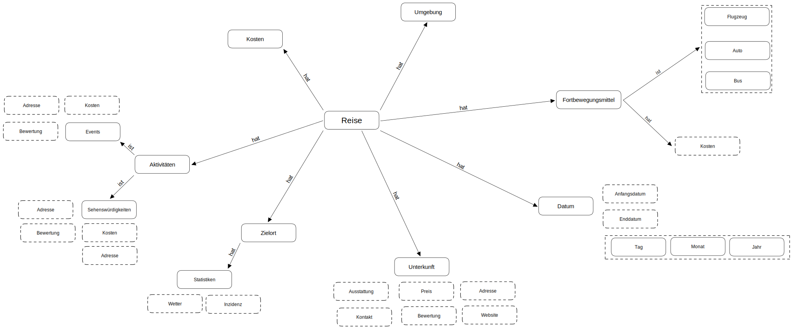
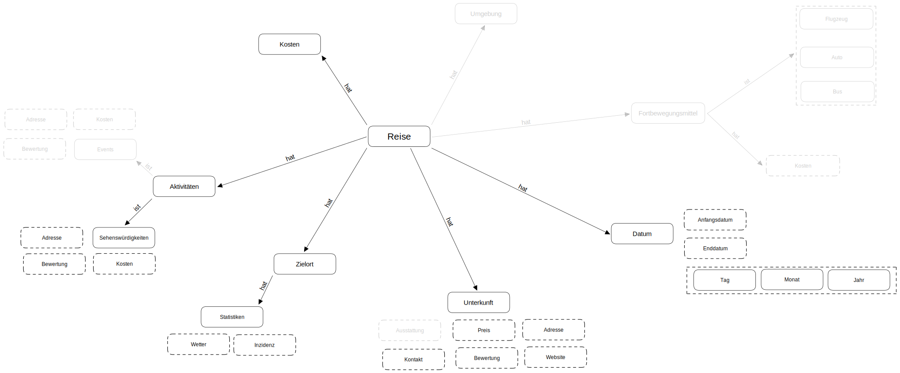

# Domain models

In order to get an overview of possible data that our API could deliver, we first set up a domain model for our problem scenario. In a further step, this model was adapted to feasibility.

 

## The Problem

 

After we found the right API's for our problem and did some research on possible API's, we were able to narrow down the scope of our API.

 

## Revised model

